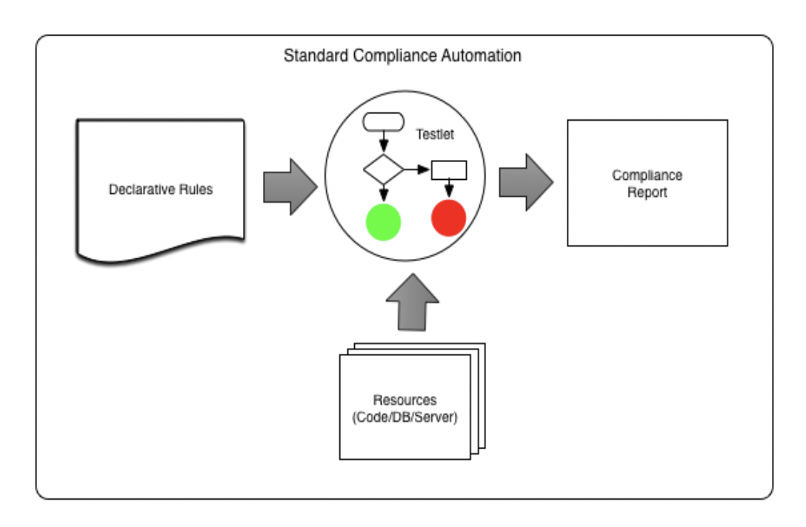

<h3 align="center">
  <br>
  
  <br><br>
  Enforcing standards, one resource at a time!

<br>
<p align="center"><a href="https://circleci.com/gh/intuit/standardly"></a></p>
</h3>


***

<div align="center">
    <p><a href="#introduction">Introduction</a></p>
    <p><a href="#prerequisites-for-installing">Prerequisites For Installing</a></p> 
    <p><a href="#how-to-use">How To Use</a></p>
    <p><a href="#running-tests">Running Tests</a></p>
    <p><a href="#extending-standardly-to-support-new-rules">Extending Standardly To Support New Rules</a></p>
    <p><a href="#pattern-matching">Pattern Matching</a></p> 
    <p><a href="#how-to-contribute">How To Contribute</a></p>
    <p><a href="#credits">Credits</a></p>
</div>


## Introduction
<h4>Do you find code, documentation, or any other resource veering off standards?</h4> 
<h4>Is it hard to enforce standards on your team when an upcoming deadline is just around the corner?</h4> 
<h4>Want to automate part of the code review process?</h4>
<p>Well have no fear, Standardly is here! Standardly is a DIY automation tool for Standards Governance.</p>

<h4>So how does it work?</h4>
<p>1. You establish standards</p>
<p>2. You translate standards into rules</p>
<p>  - Rules should be in JSON format</p>
<p>3. To run the tool, you pass Standardly the following input:</p>
<p>  - Resource to be assessed</p>
<p>  - Rules</p>
<p>  - Location to output the results</p>
<p>4. You view the results! </p>
<p>Makes sense? Below is a high-level flow chart of how Standardly works!</p>


<p>Standardly was designed in mind to work on a number of different resources: code, databases, documents, you name it! For example, for a code resource, rules can revolve around coding standards. For a database resource, rules might be that certain types of data must be encrypted, or data older than a particular date should be archived. Currently, Standardly only supports resources that are files; files that are on your filesystem or on a github repo. Okay enough chit chat, let's get to analysing your resource!</p>

## Prerequisites For Installing
* node 10.16.0
* npm
* git

## How To Use

Download/clone this repository, to clone:

```
git clone https://github.com/intuit/standardly.git 
```

Change your working directory so that you are inside the Standardly repository:

```
cd standardly
```

Before you can run the tool first install the dependencies it needs:

```
npm install 
```

Now Standardly is equipped to start scanning your resource! 
<p>To scan a local directory, run: </p>

```
standardly --localdir <directory_location> --rulesfile <fullpath_of_rules_file>
```

or 

```
standardly -l <directory_location> -r <fullpath_of_rules_file>
```

or if running in a bash shell, simply run

```
./standardly -l <directory_location> -r <fullpath_of_rules_file>
```


To scan a github repo, run:

```
standardly --giturl <url_of_gitrepo_to_scan> --rulesfile <fullpath_of_rules_file>
```

or 

```
standardly -g <url_of_gitrepo_to_scan> -r <fullpath_of_rules_file>
```

The output is created as a results.csv file in a folder named 'reports' under the current directory. If you would like to 
change the location of  the results.csv file pass a --outputdir (or simply -o) parameter to output where you want the 
results.csv file to be. Below is an example of explicitly specifying the outputdir. 

```
standardly -g https://github.com/argoproj/argo -r /Users/standardlyRocks/Desktop/standardly/sample/rules.json -o /Users/standardlyRocks/Desktop/reports
```

When this command is executed, a results.csv file will be created in the ```/Users/standardlyRocks/Desktop/reports``` directory

## Running Tests
### Unit tests
To run the unit tests in the Standardly repo, in the base directory of the repo run:

```
npm test
```
### Integration tests

```
npm run test:integration
```

## Extending Standardly To Support New Rules
See [CREATING-RULES.md](docs/CREATING-RULES.md) 

## How To Contribute
See [CONTRIBUTING.md](CONTRIBUTING.md) 
