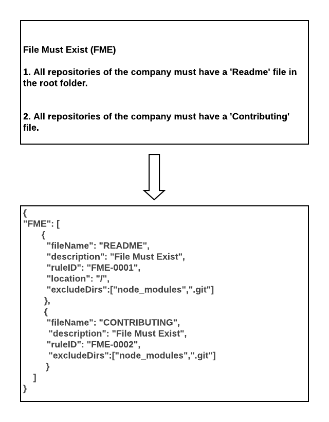

# The Rules File 

A sample rules file is available [here](../test/resources/rulesparser/sample.json)

Rules should be written in JSON format. An example of a <i>standard</i> that was turned into a <i>rule</i> is shown below:

Currently, Standardly supports the following types of rules:
* FME (File Must Exist)
* FMNE (File Must Not Exist)
* FMCP (File Must Contain Pattern)
* FMNCP (File Must Not Contain Pattern)

Each ruletype is implemented by a corresponding Testlet. For example the 'File Must Exist' rule
is implemented by the 'FileExistenceTestlet'. Testlets can be found by navigating to the [rules 
directory](../src/rules). 

Testlets essentially evaluate whether or not a rule's requirement was fullfilled. Therefore, for any rule type, a corresponding Testlet needs to exist. If you find the need to create a new rule type, we would love to help you. Please log an issue describing the type of rule you are creating and we would be happy to help you create it.
